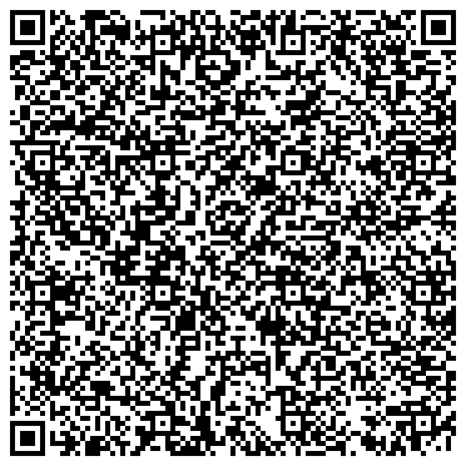

# 使用说明

## 免责声明

此服务仅用作**学习**与**研究**网络安全与网络协议目的，免费开放测试，禁止任何人以**四史**、**刷分**等谋取利益，使用此服务时请遵守四史学习平台规定，任何使用此服务**获取利益**的行为一旦被发现，会被列入黑名单，并自行承担其他一切后果。

## 附加声明

由于作者身体原因，无法继续对功能维护，目前答题功能会出现服务器被拦截、封号等问题，如需继续使用，请自行了解并承担风险与后果。

## 不会解决的问题

提示已加入队列，在队列结束后没有增加分数

微信登录时提示账户被禁用

## 项目地址

[https://github.com/Zhang-shmily/MCSOG-SSXX](https://github.com/Zhang-shmily/MCSOG-SSXX)

## 技术栈

易语言+PHP

## 文档发布地址

[https://skins.mcsog.tk:442/README.html](https://skins.mcsog.tk:442/README.html)

## 贡献此项目

在使用过程中出现问题可以提Issues，文档中问题可以通过Pull Requests方式提交，若此项目对您有帮助，请点Star。

## 四史学习入口

微信关注“中国大学生在线”，选择“四史学习”-“四史问答”，进入答题平台并绑定信息。

## 提示

### 重要

请**认真**阅读此说明，否则在使用过程中会遇到**各种**问题，并且会造成**所有用户**使用时出错。

### 提醒

在群内使用时请 **@机器人(3161075308)** ，且需要 **@蓝** ，不要直接 **复制** 其他人的消息，复制会导致@失效。

文档内不同颜色文字意义不同。

黑色 说明性文字

浅绿色 指令

青色 参数

蓝色 点击可跳转链接

### 注意

1、答题过程中进入答题界面会导致token失效，答题终止。

2、答题次数默认为10次，答题完成后可再次发送，次数范围为1-20。

3、答题速度过快会导致暂时冻结，建议两次答题时间间隔超过30分钟。

4、由于服务器数量原因，需要进行排队答题。

5、一人仅可绑定一个账号，绑定错误会造成他人无法答题。

6、账号绑定错误可以私聊申请换绑。

## 群列表

### 全国群

735955385

[")](https://qm.qq.com/cgi-bin/qm/qr?k=0qfuqtEoRvHfEZXt5PwAsGrG0BgmFR_1&jump_from=webapi)

795563329

### 河南省

958848599

[")](https://qm.qq.com/cgi-bin/qm/qr?k=7myhLAqWFKlRRKYv1UoYpKkh152tfaSc&jump_from=webapi)

723069126

### 福建省

206693520

### 云南省

667825694

[")](https://qm.qq.com/cgi-bin/qm/qr?k=Ey8S2vpYLl3P5cWkDUTuv8vqjpTzmpQu&jump_from=webapi)

大理大学

108268708

[")](https://qm.qq.com/cgi-bin/qm/qr?k=pXqZ9tyc9dUQltw71n25NQeVZIMTP6mF&jump_from=webapi)

云南农业大学

806248858

[")](https://qm.qq.com/cgi-bin/qm/qr?k=fEuJVp10uc2WZyYlaMqqyq9dZsnSirfB&jump_from=webapi)

云南师范大学商学院

753015129

[")](https://qm.qq.com/cgi-bin/qm/qr?k=VMfLAySH4wkREyQHCZHn6biEnF5LjNMR&jump_from=webapi)

云南交通运输职业学院

810129495

### 四川省

148227300

[")](https://qm.qq.com/cgi-bin/qm/qr?k=EnU6qCZ_Cn2hYwoVEtEA7qI_p2dkgHNR&jump_from=webapi)

### 湖北省

493788722

[")](https://qm.qq.com/cgi-bin/qm/qr?k=KTvztMFRLjug-DWY65aZ5rPgMCbv2PHB&jump_from=webapi)

### 山东省

740950740

[")](https://qm.qq.com/cgi-bin/qm/qr?k=1Vv8PhFAtIMFPa86JHioGhrL6enLwZ3s&jump_from=webapi)

潍坊科技学院

932428494

[")](https://qm.qq.com/cgi-bin/qm/qr?k=3UfauMUrbkUbmfyfoF0B6LdsyAHShXUU&jump_from=webapi)

齐鲁医药学院

924060422

[")](https://qm.qq.com/cgi-bin/qm/qr?k=Yz6w4LjcQRoGWd8rt6nrlZ7ZIUXZUnB6&jump_from=webapi)

### 重庆市

715807863

### 甘肃省

938958415

[")](https://qm.qq.com/cgi-bin/qm/qr?k=64gX_WvS6xEVgYAp1n4ta7sJJvGW9viK&jump_from=webapi)

### 贵州省

835432001

[")](https://qm.qq.com/cgi-bin/qm/qr?k=C_yYM_mpae2cpSsu50_fI-SjcxZkSxFe&jump_from=webapi)

### 青海省

707409064

## 招募区域/学校负责人，有意者联系机器人

## 基本指令

*本节指令在群内使用时需要@机器人，私聊使用时直接发送即可*

### 答题指令

四史答题 次数

*次数需要替换为具体数字*

### 团队答题指令

团队答题 次数

*次数需要替换为具体数字*

### 查询指令

四史详情

### 绑定指令

使用扫码方式绑定：四史绑定

使用UID方式绑定：四史绑定 UID

使用Code方式绑定：四史绑定 Code

使用Token方式绑定：四史绑定 Token

*参数需自行替换*

### 验证指令

四史账号 手机号后四位

*根据情况自行填写*

### 封禁换绑指令

无新ID：我被封了

有新ID：我被封了 新UID

*根据情况自行填写*

## 使用流程

### 1、确认已阅读此说明或有人指导

在群内@机器人发送“已阅读并遵守使用说明”或私聊发送“已阅读并遵守使用说明”。

### 2、绑定账号

首次使用时需要绑定账号，步骤如下：

1、点击[这里](https://open.weixin.qq.com/connect/oauth2/authorize?appid=wxe12424c3b8aad5e6&redirect_uri=https://core.u.hep.com.cn/oauth/wechatmp/redirect&response_type=code&scope=snsapi_userinfo&state=5f582dd3683c2e0ae3aaacee-noguard-https://ssxx.univs.cn/client/detail/5f71e934bcdbf3a8c3ba5061&connect_redirect=1) (https://open.weixin.qq.com/connect/oauth2/authorize?appid=wxe12424c3b8aad5e6&redirect_uri=https://core.u.hep.com.cn/oauth/wechatmp/redirect&response_type=code&scope=snsapi_userinfo&state=5f582dd3683c2e0ae3aaacee-noguard-https://ssxx.univs.cn/client/detail/5f71e934bcdbf3a8c3ba5061&connect_redirect=1) 进入四史答题平台，确认能进入**个人页**。

2、向机器人发送[绑定指令](#绑定指令)，机器人会提示绑定方式并进行绑定。

*使用他人信息绑定会导致无法答题*

3、机器人提示验证后发送[验证指令](#验证指令)，机器人确认后将会开始答题。

*若提示 已绑定其他账号 为手机号已被其他账号绑定，可私聊修改*

*若忘记手机号可以在[这里](#查询个人信息)查询*

*信息不符时需要重复2~3步*

*为避免代刷等违规使用，首次答题时次数固定为**10**次，如需中断可在微信登录到个人页*

### 3、答题

发送[答题指令](#答题指令)即可。

*发送时注意次数范围*

*若上次答题任务未完成，则会提示正在答题*

### 4、查询

发送[查询指令](#查询指令)即可。

*若提示 未同步分数 为从未答题或尚未同步分数*

### 5、封禁换绑

发送[封禁换绑指令](#封禁换绑指令)即可。

## 错误原因说明

### 未绑定账号

按步骤进行账号绑定。

### 未验证账号

按步骤进行账号验证。

### 在其他地方登录

在答题过程中账号在其他位置(例如：微信、网页版、其他第三方软件)登录。

### 账号不存在

未在四史答题平台绑定过账号或没有团队。

### 问题不存在

在四史答题题库中某道题目ID无效。

### 账号被风控，请自行答题一天

由于账号异常操作导致被平台风控，需自行解除，目前并无因本服务导致账号异常的个例。

## 获取信息

### 获取UID

步骤如下：

1、打开微信X5浏览器[调试](http://debugx5.qq.com/) (http://debugx5.qq.com/) 模式。（可在微信打开此页面）

2、切换到“信息”页并选中“打开vConsole调试功能”。

3、进入微信端四史答题入口，找到底部vConsole。

4、点击vConsole，在command处输入localStorage并点击OK。

5、展开返回内容，找到“id”并复制引号内内容。

抓包同理

### 获取Code

步骤如下：

1、在电脑开启Fiddler并登录电脑版微信。

2、在Fiddler下断点于core.u.hep.com.cn。

3、进入微信端四史答题入口，同意授权之后在Fiddler找到对应包。

4、复制请求中code部分。

### 查询个人信息

步骤如下：

使用微信打开此[链接](https://open.weixin.qq.com/connect/oauth2/authorize?appid=wxe12424c3b8aad5e6&redirect_uri=https://core.u.hep.com.cn/oauth/wechatmp/redirect&response_type=code&scope=snsapi_userinfo&state=5f582dd3683c2e0ae3aaacee-noguard-https://skins.mcsog.tk:442/info/GetInfo.php&connect_redirect=1) (https://open.weixin.qq.com/connect/oauth2/authorize?appid=wxe12424c3b8aad5e6&redirect_uri=https://core.u.hep.com.cn/oauth/wechatmp/redirect&response_type=code&scope=snsapi_userinfo&state=5f582dd3683c2e0ae3aaacee-noguard-https://skins.mcsog.tk:442/info/GetInfo.php&connect_redirect=1) 或扫描下方二维码

